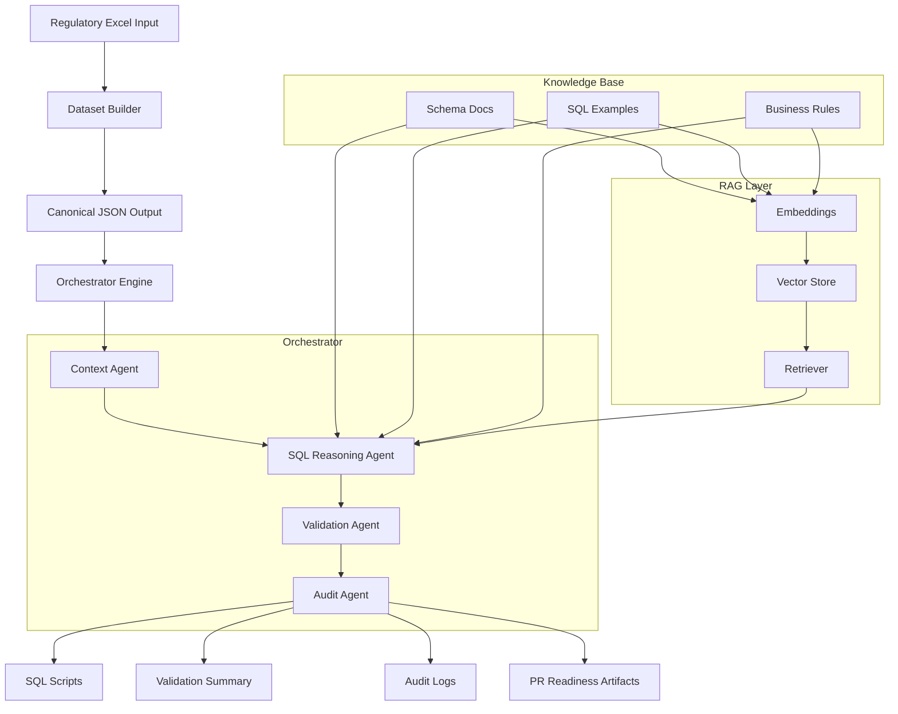

This repo has 2 major components:

1. Dataset Builder
   - Converts regulatory Excel → structured JSON

2. Agentic Orchestrator
   - Generates SQL
   - Validates rules
   - Produces audit logs
   - Prepares PR artifacts

## PPS Release Orchestrator – Architecture

## dataset_builder - Run steps 
Use the Windows Python launcher py to build a venv
1. create venv using the system Python (py chooses an installed Python 3)
    py -3 -m venv .venv
2. activate
    .\.venv\Scripts\Activate.ps1
3. Install dependencies - within the virtual env
      pip install -r requirements.txt
4. Run the canonical build script (with optional business excels)

    # Basic usage (no business excels)
    python .\build_canonical_json.py `
        --master ".\data\master\master.xlsx" `
        --sql-root ".\data\sql" `
        --out ".\out\canonical.json"

    # With business excels (add one or more --business args)
    python .\build_canonical_json.py `
        --master ".\data\master\master.xlsx" `
        --sql-root ".\data\sql" `
        --business ".\data\business_excels\V2601.01 - default value and description updates Medicare_ASC.xlsx" `
        --business ".\data\business_excels\V2601.01 - default value and description updates Medicare_DRG.xlsx" `
        --out ".\out\canonical.json"

5. Run the simple canonical build (auto-discovers business excels)

    python .\build_canonical_simple.py `
        --master ".\data\master\master.xlsx" `
        --sql-root ".\data\sql" `
        --out ".\out\canonical_simple.json"

    - This script automatically scans all Excel files under .\data\business_excels and matches them to master rows by title.
    - Only SQL blocks for those stories are included in the output.

